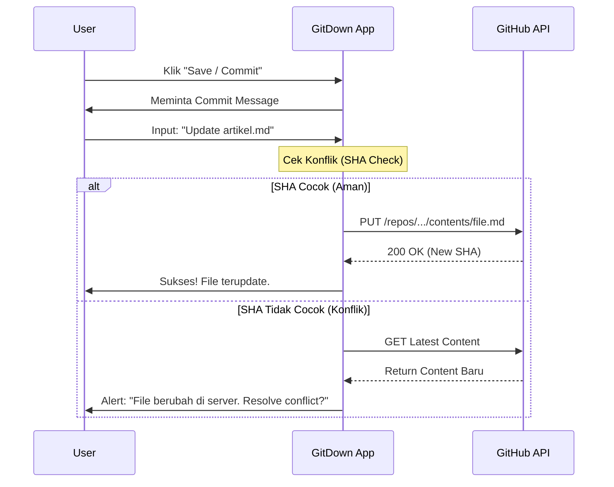

# GitDown Pro 📝


> **Editor Markdown "Serverless" canggih yang mengubah Repository GitHub kamu menjadi CMS pribadi.**

[](https://nextjs.org/)
[](https://www.typescriptlang.org/)
[](LICENSE)
[]()

## 📖 Tentang Proyek

**GitDown Pro** adalah aplikasi web editor Markdown yang terinspirasi oleh StackEdit, namun dibangun dengan filosofi **Git-Centric**. Tidak ada database proprietary yang menyimpan data kamu. Semua catatan, artikel, dan gambar disimpan langsung ke Repository GitHub pilihan kamu.

Ini memberikan kamu kontrol penuh atas data (Data Ownership), version control bawaan, dan kemudahan kolaborasi.

## ✨ Fitur Utama

*   **GitHub Sync (2-Way):** Tarik konten terbaru dari repo dan Push perubahan dengan commit message kustom.
*   **Editor Split-View:** Menulis di kiri, preview live HTML di kanan (dengan Scroll Sync presisi).
*   **File Explorer:** Navigasi folder repo layaknya file manager native.
*   **Manajemen Aset:** Drag & drop gambar ke editor, otomatis upload ke folder `/assets` di repo.
*   **Kategorisasi:** Menggunakan struktur folder GitHub sebagai kategori.
*   **Offline Support:** Draft disimpan di browser (IndexedDB) sebelum di-commit.
*   **Dukungan Syntax:** GFM (Tables, Task lists), MathJax (LaTeX), dan Mermaid.js.

---

## 🏗️ Arsitektur Sistem

Berikut adalah gambaran bagaimana GitDown Pro bekerja tanpa database backend tradisional.

### 1. Alur Data (Data Flow)

```mermaid
graph TD
    User((User))
    
    subgraph "Browser (Client-Side)"
        UI[Next.js UI Shell]
        Editor[CodeMirror Editor]
        Cache[Local DB / Zustand]
    end
    
    subgraph "Authentication"
        NextAuth[NextAuth.js]
    end

    subgraph "GitHub Cloud"
        API[GitHub API (Rest/GraphQL)]
        Repo[(User Repository)]
    end

    User --> UI
    UI -->|1. Login (OAuth)| NextAuth
    NextAuth -->|2. Access Token| UI
    
    UI -->|3. Fetch Tree & Files| API
    API <-->|4. Read/Write| Repo
    
    Editor -->|5. Auto-save Draft| Cache
    Editor -->|6. Commit & Push| API
```

### 2. Logika Sinkronisasi (Sync Logic)

Diagram ini menjelaskan apa yang terjadi ketika pengguna menekan tombol "Save/Commit".



---

## 🛠️ Tech Stack

*   **Framework:** [Next.js 14](https://nextjs.org/) (App Router)
*   **Language:** TypeScript
*   **Styling:** Tailwind CSS + Shadcn/UI
*   **Auth:** NextAuth.js (GitHub Provider)
*   **State Management:** Zustand
*   **Editor Engine:** CodeMirror 6
*   **Markdown Parsing:** Remark / Rehype / Mermaid
*   **API Client:** Octokit

---

## 🚀 Cara Menjalankan (Development)

Ikuti langkah ini untuk menjalankan proyek di komputer lokal.

### Prasyarat
*   Node.js 18+
*   Akun GitHub (untuk membuat OAuth App)

### 1. Clone Repository
```bash
git clone https://github.com/username/gitdown-pro.git
cd gitdown-pro
```

### 2. Install Dependencies
```bash
npm install
# atau
yarn install
```

### 3. Konfigurasi Environment Variables
Buat file `.env.local` di root folder dan isi dengan kredensial GitHub OAuth kamu:

```env
GITHUB_ID=your_github_client_id
GITHUB_SECRET=your_github_client_secret
NEXTAUTH_SECRET=random_string_secret_key
NEXTAUTH_URL=http://localhost:3000
```

> **Catatan:** Kamu perlu membuat OAuth App di [GitHub Developer Settings](https://github.com/settings/developers) dan set *Authorization callback URL* ke `http://localhost:3000/api/auth/callback/github`.

### 4. Jalankan Server
```bash
npm run dev
```
Buka `http://localhost:3000` di browser.

---

## 📂 Struktur Folder

```text
/src
  /app           # Next.js App Router pages
  /components    # React Components
    /editor      # Komponen Editor & Preview
    /sidebar     # File Explorer & Repo Picker
  /lib           # Utilitas (GitHub API wrapper, Store)
  /types         # TypeScript definitions
```

## 🤝 Kontribusi

Kontribusi sangat diterima! Silakan fork repository ini dan buat Pull Request untuk fitur baru atau perbaikan bug.

1.  Fork Project
2.  Create Feature Branch (`git checkout -b feature/AmazingFeature`)
3.  Commit Changes (`git commit -m 'Add some AmazingFeature'`)
4.  Push to Branch (`git push origin feature/AmazingFeature`)
5.  Open Pull Request

## 📄 Lisensi

Didistribusikan di bawah Lisensi MIT. Lihat `LICENSE` untuk informasi lebih lanjut.
```

### Cara Menampilkan Diagram Mermaid di GitHub
GitHub secara native sudah mendukung rendering **Mermaid**. Ketika kamu meng-upload file ini ke GitHub, blok kode yang diawali dengan ` ```mermaid ` akan otomatis berubah menjadi diagram visual yang interaktif.